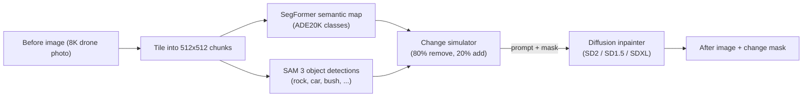

# Data-Generation-OCD-ChangeAnywhere

Synthetic **change-detection** dataset generator for aerial/drone imagery,
inspired by the *ChangeAnywhere* paper. The pipeline takes a real `before`
image, programmatically invents a plausible change (a new rock appears on
the ground, a car disappears from the dirt road, ...), renders the
corresponding `after` image with a diffusion inpainter, and emits the
pixel-perfect binary change mask that pairs the two. The result is a
free, unlimited supply of `(before, after, change_mask)` training triplets
that look real enough to train change-detection networks on.

---

## Table of contents

1. [Why this exists](#why-this-exists)
2. [High-level idea](#high-level-idea)
3. [Which pipeline should I run?](docs/PIPELINES.md) (full-image vs tile vs legacy)
4. [Project layout](#project-layout)
5. [File-by-file tour](#file-by-file-tour)
6. [Models used](#models-used)
7. [Installation](#installation)
8. [Quick start](#quick-start)
9. [Configuration reference](#configuration-reference)
10. [Design decisions worth knowing](#design-decisions-worth-knowing)
11. [Outputs on disk](#outputs-on-disk)
12. [Troubleshooting](#troubleshooting)

---

## Why this exists

Training a change-detection model needs thousands of `(before, after, mask)`
triplets where the two images are *perfectly aligned* and the mask
*perfectly labels* every changed pixel. Collecting such data from the real
world is expensive: you need two flights over the same location taken on
different days with sub-pixel registration plus human annotators marking
every rock, car, or bush that moved.

This repo sidesteps the problem: starting from a *single* real aerial
image (`before`), it synthesizes a realistic `after` by *adding* or
*removing* a few objects using a diffusion model, and records the exact
change region as the ground-truth mask. The geometry is identical to the
original frame by construction, so alignment is free.

## High-level idea



Two operating modes coexist:

- **Tile-based** ([`src/scripts/process_one.py`](src/scripts/process_one.py)):
  cuts the full image into 512x512 tiles, processes each tile independently,
  and produces visual comparison grids. Good for quick qualitative checks.
- **Object-centric / full-image** ([`src/scripts/generate_pair.py`](src/scripts/generate_pair.py)):
  scans the whole image with 1024x1024 crops, picks the 1-3 most visible
  objects, inpaints each one directly at full resolution, and emits a single
  aligned `(before.jpg, synthetic_after.jpg, change_mask.png, meta.json)`
  training triplet. This is the path used for dataset generation.

## Project layout

```
Data-Generation-OCD-ChangeAnywhere/
  docs/
    PIPELINES.md                  # which script / track to use
    EXPERIMENT_REAL_VAL.md        # protocol: synthetics vs real val F1
  requirements.txt                  # Python dependencies
  README.md                         # this file
  src/
    config.yaml                     # single source of truth for all knobs
    data/
      original_OCD_dataset/         # real input pairs (pair_0000/, pair_0001/, ...)
        pair_0000/
          before.jpg                # aerial image (input)
          after.jpg                 # real paired "after" (reference only)
          after_binary_mask.png     # human-annotated GT mask (reference only)
          after_with_polygons.jpg   # annotated overlay (reference only)
          annotations.json
          metadata.json
      workspace/                    # all generated artefacts (gitignored)
        tiles/                      # 512x512 crops of each before image
        masks/                      # cached SegFormer semantic maps
        synthetic/                  # generated pairs + comparison grids
    pipeline/                       # reusable library code
      __init__.py
      config.py                     # YAML loader -> Config object
      io.py                         # image / JSON / polygon helpers
      tiler.py                      # tile + reassemble utilities
      segmentation.py               # SegFormer + SAM 3 wrappers + fallback
      sam_integration.py            # SAM 3 detect_objects() + segment()
      inpainting.py                 # diffusion wrapper (3 backends, bbox dilation)
      change_simulator.py           # picks WHAT to change and builds the mask
      prompt_templates.py           # ADE20K -> prompts for SD
      synthetic.py                  # re-exports (see full_image + tile_synthetic)
      full_image.py                 # select_best_objects, generate_full_image_pair, ...
      tile_synthetic.py             # generate_synthetic_pair, batch_generate (per-tile)
      dataset.py                    # batch driver (tile -> segment -> generate)
    scripts/                        # end-user entry points
      process_one.py                # tile-based pipeline (one pair, grid outputs)
      generate_pair.py              # object-centric full-resolution pair
      generate_dataset.py           # batch full-image dataset + manifest
      eval_detection_modes.py       # text vs auto SAM eval + CSV / vis
      compare_inpaint_backends.py   # A/B compare SD2 vs SD1.5 vs SDXL
      run_segment_and_generate.py   # legacy tile batch driver
```

## File-by-file tour

### Configuration and I/O primitives

- **[`src/config.yaml`](src/config.yaml)** - all tunable parameters live
  here: paths, tile size, which segmentation model to use, SAM 3 prompts
  and thresholds, diffusion backend selection and per-backend sampling
  settings, synthetic event probabilities, and the bbox-aware mask
  dilation knobs. Every script reads this file through `Config`.

- **[`src/pipeline/config.py`](src/pipeline/config.py)** - thin YAML
  loader. Resolves `{work_root}` templating in the `data:` paths and
  exposes named sections (`cfg.data`, `cfg.tiling`, `cfg.segmentation`,
  `cfg.inpainting`, `cfg.synthetic`, `cfg.assembler`).

- **[`src/pipeline/io.py`](src/pipeline/io.py)** - small helpers:
  `load_image`, `save_image`, `read_json`, `write_json`,
  `polygons_to_mask` (rasterize a list of polygon vertices to a binary
  mask), `pil_to_numpy`, `numpy_to_pil`.

### Tiling

- **[`src/pipeline/tiler.py`](src/pipeline/tiler.py)** - cuts a full image
  into overlapping 512x512 tiles named `basename_xNNNN_yNNNN.png`. Key
  functions:
  - `tile_image(img, tile_size, overlap)` - generator yielding
    `(x, y, tile_pil)`.
  - `is_tile_nonempty(tile, min_nonempty_ratio)` - drops blank or
    near-uniform tiles using a simple median-deviation heuristic.
  - `save_tiles_for_image(img_path, out_dir, ...)` - convenience wrapper
    that writes every non-empty tile to disk.
  - `reassemble_tiles(...)` - glues tiles back into a full image,
    optionally substituting a `replacements` dict (`stem -> PIL`). Used
    when only a few tiles were modified and we need to stitch the full
    synthetic `after`.
  - `build_change_mask(...)` - composes a full-resolution binary mask
    from per-tile masks for the tiles that were modified.

### Segmentation

- **[`src/pipeline/segmentation.py`](src/pipeline/segmentation.py)** -
  defines a small `SegmentationModel` ABC and three concrete
  implementations:
  - `FallbackSLIC` - pure scikit-image SLIC superpixels. No deps, no GPU,
    used when transformers is unavailable.
  - `SegformerModel` - wraps `nvidia/segformer-b5-finetuned-ade-640-640`
    and returns a per-pixel ADE20K class ID map. This is what the change
    simulator uses to decide which region is "background terrain".
  - Factory `get_segmentation_model(name, cfg)` - picks the right model
    based on `segmentation.active_model` in config (`fallback` /
    `segformer` / `sam`).

- **[`src/pipeline/sam_integration.py`](src/pipeline/sam_integration.py)** -
  wraps `facebook/sam3` with two different entry points:
  - `SAMModel.segment(pil)` - open-vocabulary segmentation using a list
    of text prompts (tree, road, car, ...), returns a merged integer
    class map.
  - `SAMModel.detect_objects(pil, prompts, min_score, ...)` - returns
    per-instance dicts with `{mask, label, score, area_ratio}`. This is
    the **primary way** the pipeline locates removable objects.

### The core idea: change simulation and prompts

- **[`src/pipeline/change_simulator.py`](src/pipeline/change_simulator.py)** -
  where the `(change_mask, prompt, meta)` triplet is born. Three event
  types:
  - `simulate_appearance(seg_map)` - picks a large terrain region from
    SegFormer (grass, dirt, ...), draws a random irregular blob in it,
    and asks SD to *paint* a rock / bush / box onto that ground.
  - `simulate_disappearance(seg_map)` - picks a non-background segment,
    dilates it slightly, and asks SD to *erase* it back to ground.
  - `simulate_disappearance_targeted(detected_objects, seg_map)` - given
    SAM 3 instance masks, picks 1-2 detected objects (weighted by
    confidence) and builds a combined removal mask. Used whenever SAM 3
    actually found something concrete in the tile.
  - `simulate_change(...)` - top-level dispatcher: flips a coin against
    `synthetic.appearance_prob` (default 20%) and picks the right
    function.

- **[`src/pipeline/prompt_templates.py`](src/pipeline/prompt_templates.py)** -
  maps ADE20K class IDs to natural-language backgrounds (`class 9 ->
  "green grass field"`, `class 13 -> "dry brown earth ground"`, ...) and
  stores prompt templates per object type. It also tone-matches: on a
  green field it prefers rocks and bags, on a brown field it prefers
  bushes. The negative prompt is fixed and discourages seams and color
  fringes.

### Inpainting (the model-heavy part)

- **[`src/pipeline/inpainting.py`](src/pipeline/inpainting.py)** - the
  single workhorse class `InpaintingModel` plus its config factory
  `build_inpainter_from_cfg()`. Features:
  - **Three switchable backends** via the `_BACKENDS` registry:
    - `sd2` - `sd2-community/stable-diffusion-2-inpainting`, 512 native.
    - `sd15_realistic` - `Lykon/dreamshaper-8-inpainting`, 512 native,
      photorealistic SD1.5 fine-tune.
    - `sdxl` - `diffusers/stable-diffusion-xl-1.0-inpainting-0.1`,
      1024 native. Enables `model_cpu_offload` + VAE slicing/tiling to
      fit on 8 GB VRAM.
  - **Three public entry points:**
    - `inpaint(image, mask, prompt)` - tile-level convenience: feathers
      mask, runs SD, alpha-blends the result back.
    - `inpaint_raw(image, mask, prompt)` - returns the raw SD output
      without any blending. The caller is responsible for blending.
    - `inpaint_object(full_image, obj_mask_fullimg, prompt, bbox)` -
      crops a padded region around the object, downsamples to the
      backend's native resolution if needed, inpaints, upsamples back,
      and returns a Poisson-blended crop ready to paste onto the full
      canvas.
  - **Bbox-aware mask dilation** (`_object_dilate_iterations`): instead
    of dilating the mask by a fixed 8 px, the dilation scales with
    object size (`max(8, min(48, 0.08 * min(bbox_w, bbox_h)))`). This
    eliminates the colored-edge artefact where a removed car's shadow
    was left visible just outside a too-small mask.
  - **Seamless blending** via `cv2.seamlessClone` (Poisson), with an
    alpha-feather fallback. The clone mask uses the same bbox-aware
    dilation as the SD feather, so SD's fill area and Poisson's blend
    area are always perfectly aligned.
  - **Safety checker disabled** on SD1/SD2 pipelines because the CLIP
    NSFW filter false-fires on plain aerial imagery and returns black
    frames.

### Synthetic pair generation

- **[`src/pipeline/synthetic.py`](src/pipeline/synthetic.py)** - thin re-exports
  for backward-compatible imports. Implementations live in
  [`full_image.py`](src/pipeline/full_image.py) and
  [`tile_synthetic.py`](src/pipeline/tile_synthetic.py):
  - `generate_synthetic_pair` / `batch_generate` (tile path) — local SSIM on
    a crop around the change mask; see [`docs/PIPELINES.md`](docs/PIPELINES.md).
  - `select_best_objects` / `select_appearance_locations` /
    `generate_full_image_pair` (full-image path) — used by
    `generate_pair.py` and `generate_dataset.py`.

- **[`src/pipeline/dataset.py`](src/pipeline/dataset.py)** - `Pipeline`
  class wrapping the classic three-stage batch:
  `tile_all() -> segment_tiles() -> generate_synthetic()`. Writes cached
  SegFormer maps to `workspace/masks/*_seg.npy`, writes synthetic pairs
  under `workspace/synthetic/<pair>/`, and appends every result to
  `provenance.csv` (kept / filtered / error).

### Scripts (entry points)

- **[`src/scripts/process_one.py`](src/scripts/process_one.py)** - runs
  the *tile-based* pipeline on a single pair (default `pair_0000` from
  config). For each of 5 randomly-sampled interesting tiles it produces a
  7-panel grid (`before`, semantic map, SAM 3 detections, change region,
  synthetic after, change mask, after+overlay). Good for eyeballing
  quality while tuning.

- **[`src/scripts/generate_pair.py`](src/scripts/generate_pair.py)** -
  runs the *object-centric* pipeline on a single pair at full
  resolution. Scans the whole image with SAM 3 at 1024x1024, picks the
  best 1-3 objects, inpaints each one directly on the full canvas
  using `inpaint_object`, and writes:
  - `synthetic_after.jpg` - the full-resolution synthetic after.
  - `change_mask.png` - full-resolution binary mask.
  - `overview.png` - side-by-side comparison with per-object crops.
  - `meta.json` - one entry per removed object with label, score,
    bbox, prompt.

- **[`src/scripts/generate_dataset.py`](src/scripts/generate_dataset.py)** -
  batch driver for producing an arbitrary number of full-resolution
  synthetic pairs. Takes a source folder of images (auto-detects either
  `pair_*/before.jpg` layout or a flat folder of `.jpg`/`.png`),
  randomly samples one input per iteration using a **balanced sampler**
  (each input gets `floor(N/K)` or `ceil(N/K)` draws, max imbalance 1),
  picks `k ~ Uniform[min_objects, max_objects]` object changes per pair,
  and for each of the `k` slots flips `synthetic.appearance_prob` to
  choose between adding a new object and removing an existing one.
  Loads SAM 3 / SegFormer / inpainter once and reuses them for every
  iteration, and writes a `manifest.csv` plus one `gen_{i:05d}/` folder
  per sample. See [Batch dataset generation](#batch-dataset-generation)
  below.

- **[`src/scripts/compare_inpaint_backends.py`](src/scripts/compare_inpaint_backends.py)** -
  A/B-tests the three inpainting backends on identical input. Loads
  SegFormer + SAM 3 once, simulates one change per sampled tile, then
  loads each backend serially (they cannot co-exist in 8 GB VRAM),
  renders the same change with each, and saves
  `<tile>_compare.png = [Before | Change Region | SD2 | SD1.5 Realistic | SDXL | Mask]`.
  Supports `--tile <stem>` to pin a specific tile and `--n-samples N` to
  change random sampling.

- **[`src/scripts/eval_detection_modes.py`](src/scripts/eval_detection_modes.py)** -
  compares SAM 3 **text** vs **auto** detection on full `before.jpg` images;
  writes a CSV and optional side-by-side JPEGs (see [`docs/PIPELINES.md`](docs/PIPELINES.md)).

- **[`src/scripts/run_segment_and_generate.py`](src/scripts/run_segment_and_generate.py)** -
  simplest batch driver: runs `Pipeline.segment_tiles()` + `Pipeline.generate_synthetic()`
  on everything already tiled.

## Models used

| Role | Model | Repo | VRAM (fp16) | Why this one |
|---|---|---|---|---|
| Semantic segmentation | SegFormer-B5 | `nvidia/segformer-b5-finetuned-ade-640-640` | ~0.6 GB | ADE20K gives ~150 classes; we only need the terrain categories to decide background tone. Fast (~60 ms per tile). |
| Object detection + masks | SAM 3 | `facebook/sam3` (gated) | ~1.5 GB | Open-vocabulary - takes text prompts like "rock" or "car" and returns instance masks. Strictly stronger than ad-hoc CNN detectors for this use case. |
| Inpainting (default) | SD2-Inpaint | `sd2-community/stable-diffusion-2-inpainting` | ~4.5 GB | 512 native, fast, good baseline. |
| Inpainting (alt 1) | DreamShaper-8 Inpaint | `Lykon/dreamshaper-8-inpainting` | ~3.0 GB | SD1.5 photorealistic fine-tune; often cleaner on natural outdoor scenes. |
| Inpainting (alt 2) | SDXL-Inpaint | `diffusers/stable-diffusion-xl-1.0-inpainting-0.1` | ~5.5 GB with CPU offload | 1024 native; preserves detail on large crops. |

SAM 3 is a **gated** Hugging Face repo, so you must accept its license
on the web and authenticate once with a token (see
[Installation](#installation)).

## Installation

### 1. Python and CUDA

- Python 3.11 (the project is developed against cpython 3.11).
- A CUDA GPU with >= 6 GB VRAM is strongly recommended. The project is
  regularly tested on an RTX 4060 (8 GB).
- The transformers >= 5 security gate requires torch >= 2.6, so install
  the CUDA 12.4 wheels (not 12.1):

```powershell
pip install torch torchvision torchaudio --index-url https://download.pytorch.org/whl/cu124
```

### 2. Everything else

```powershell
pip install -r requirements.txt
```

### 3. Hugging Face authentication (once)

SAM 3 is gated; accept the license at
<https://huggingface.co/facebook/sam3> using the same account whose
token you pass below, then persist the token:

```powershell
python -c "from huggingface_hub import login; login(token='hf_YOUR_REAL_TOKEN')"
python -c "from huggingface_hub import whoami; print(whoami()['name'])"
```

The SegFormer and diffusion models are ungated and will download
automatically on first use.

### 4. Verify CUDA

```powershell
python -c "import torch; print(torch.__version__, torch.cuda.is_available(), torch.cuda.get_device_name(0))"
```

Expected: `2.6.0+cu124 True NVIDIA ...`.

## Quick start

### Put one real pair in

Drop any real aerial image pair under
`src/data/original_OCD_dataset/pair_0000/` with at least `before.jpg` (the
`after.jpg`, `annotations.json`, `after_binary_mask.png` files are only
used as reference for the GT overview panel; they're not needed to
generate synthetic data).

### Tile-based test (grid outputs for quick inspection)

```powershell
python .\src\scripts\process_one.py
```

Outputs: `src/data/workspace/synthetic/pair_0000/<tile>_grid.png` plus a
`pair_0000_gt_overview.png`.

### Full-resolution synthetic pair (the main dataset-generation path)

```powershell
python .\src\scripts\generate_pair.py          # defaults to testing.test_pair
python .\src\scripts\generate_pair.py pair_0011
```

Outputs: `src/data/workspace/synthetic/<pair>/full/{synthetic_after.jpg,
change_mask.png, overview.png, meta.json}`.

### Batch dataset generation

Generate `N` synthetic pairs in one shot from a folder of source images:

```powershell
python .\src\scripts\generate_dataset.py `
    --input-dir src\data\original_OCD_dataset `
    --n-images 1000 `
    --output-dir src\data\workspace\dataset_v1 `
    --min-objects 1 --max-objects 20 `
    --seed 42
```

The script:

- **Auto-detects the input layout.** If `--input-dir` contains
  `pair_*/before.jpg` subfolders, those are used; otherwise it
  recursively globs `.jpg` / `.jpeg` / `.png` files.
- **Samples inputs in a balanced way.** Given `K` source images and
  `N` requested outputs, every image gets either `floor(N/K)` or
  `ceil(N/K)` draws (max imbalance of 1). Order is still shuffled
  deterministically from `--seed`.
- **Randomizes object count per pair.** Each generated image has a
  random number `k` of object changes drawn from
  `Uniform[min_objects, max_objects]` (inclusive).
- **Randomizes add vs remove per object.** For each of the `k` slots,
  flips `synthetic.appearance_prob` (default 0.20 — 20% add, 80%
  remove). Override via `--appearance-prob 0.5` if needed. If SAM 3
  doesn't actually find enough removable objects in an image, we do
  as many as we found and record the shortfall in `meta.json`.
- **Loads models once, reuses for all N.** SAM 3 + SegFormer +
  inpainter load at startup (~30 s) and then each iteration is
  inpainting-bound, not loading-bound.

Output layout:

```
dataset_v1/
  manifest.csv                   # one row per sample (see below)
  gen_00000/
    before.jpg                   # copy of the sampled source
    synthetic_after.jpg          # full-resolution after
    change_mask.png              # full-resolution binary mask
    comparison.png               # 2x2 grid (Before / After / Mask / Overlay)
                                 #   with large titles for quick QA
    meta.json                    # per-change details + backend + seed
    overview.png                 # only if --save-overview (close-up crops)
  gen_00001/
    ...
```

`comparison.png` is emitted by default and is the easiest file to open
when reviewing results -- it shows the original, the synthetic output,
the binary change mask, and a red-contour overlay on the before image
so the edited region pops out even when the synthetic change is
visually subtle. Pass `--no-comparison` to suppress it, or
`--comparison-width 2048` to make the panels larger.

`manifest.csv` columns:
`id, source_path, n_requested, n_applied, n_add_requested,
n_add_applied, n_remove_requested, n_remove_applied, labels, status,
elapsed_s`. `status` is `ok`, `empty` (no changes actually produced -
rare, only when SAM found nothing AND all appearance attempts were
rejected), or `error: ...`.

Useful extras:

- `--save-overview` - also emits `overview.png` per sample for visual
  QA (roughly doubles disk usage).
- `--backend sdxl` - override the inpainting backend for this run
  without editing the config.
- `--appearance-prob 0.5` - override the add/remove ratio.
- `--config some/other/config.yaml` - use a different config file.

### Compare the three inpainters on the same tile

```powershell
python .\src\scripts\compare_inpaint_backends.py                           # 3 random tiles
python .\src\scripts\compare_inpaint_backends.py --tile before_x3584_y3136 # one specific tile
python .\src\scripts\compare_inpaint_backends.py pair_0003 --n-samples 5
```

Outputs: `src/data/workspace/synthetic/<pair>/<tile>_compare.png`.

### Switch inpaint backend

Edit a single line in [`src/config.yaml`](src/config.yaml):

```yaml
inpainting:
  backend: "sdxl"    # or "sd2" (default), "sd15_realistic"
```

All three scripts (`process_one`, `generate_pair`,
`compare_inpaint_backends`) honor this immediately.

### Prompt-free detection (auto mode)

By default SAM 3 is driven by a text-prompt list
(`segmentation.sam.detection_prompts`) -- you tell it exactly what to
look for. For real-time scenarios where the set of meaningful objects
isn't known in advance, the pipeline also supports a **prompt-free
"segment-everything" mode**:

```yaml
segmentation:
  sam:
    detection_mode: "auto"   # "text" (default) | "auto"
```

Or override per-run without editing the config:

```powershell
python .\src\scripts\generate_pair.py    pair_0000 --detection-mode auto
python .\src\scripts\generate_dataset.py --input-dir ... --n-images 50 --detection-mode auto
```

What the two modes do:

| Mode | Input to SAM 3 | Output labels | When to use |
|---|---|---|---|
| `text` | `detection_prompts` list (e.g. `["rock","car","box",...]`) | real category names | You know ahead of time which objects matter. |
| `auto` | 16x16 grid of seed points (no text) | all `"object"` | You don't know what will appear. |

In auto mode the pipeline filters SAM's mask flood so you keep only
"meaningful objects":

- **Geometric filters** drop masks that are too ragged
  (`min_compactness`) or too visually similar to their surroundings
  (`min_contrast`).
- **Terrain filter** (`sam.auto.ignore_terrain`, default `true`)
  runs SegFormer on each scan crop and drops masks whose dominant
  ADE20K class is grass / earth / sand / sidewalk / etc. Without this,
  "segment everything" happily returns giant ground blobs.

All auto-mode knobs live in `segmentation.sam.auto` in
[`src/config.yaml`](src/config.yaml):

```yaml
segmentation:
  sam:
    detection_mode: "auto"
    auto:
      points_per_side: 16    # 256 seed points per 1024 scan crop
      ignore_terrain: true   # drop terrain/vegetation masks
      min_area_ratio: 0.0005
      max_area_ratio: 0.15
      min_compactness: 0.25
      min_contrast: 8.0
```

**Speed trade-off.** Auto mode feeds SAM 3 a single dense box grid per
crop, while text mode runs one SAM pass per prompt (six by default).
On a smoke test over `pair_0000` the *detection* stage was actually
faster in auto mode (~48 s vs ~158 s), but auto mode adds one extra
SegFormer pass per crop when `ignore_terrain=true`. Either way, SD
inpainting dominates overall wall-clock.

**Labels caveat.** Auto mode does not produce per-class labels
(SAM 3 has no text to attach). Every detection comes out as
`label: "object"` in `meta.json`. Downstream prompts for SD are
unaffected because they only need the *background* class (from
SegFormer) plus the event kind; they do not use the SAM label.

## Configuration reference

See [`src/config.yaml`](src/config.yaml). The most common knobs:

| Section | Key | Effect |
|---|---|---|
| `tiling` | `tile_size`, `overlap` | 512 / 64 are a good default for 8K drone frames. Raising `overlap` helps seam-hiding at the cost of more tiles. |
| `segmentation.sam` | `detection_mode` | `text` uses `detection_prompts`; `auto` runs SAM 3 prompt-free and keeps meaningful masks (see *Prompt-free detection* above). |
| `segmentation.sam` | `detection_prompts` | What SAM 3 looks for in `text` mode. Domain-specific: add "person", "pallet", etc. as needed. Ignored in `auto` mode. |
| `segmentation.sam` | `detection_score_threshold` | Minimum SAM 3 confidence. Higher = fewer, more certain objects. |
| `segmentation.sam.auto` | `points_per_side`, `ignore_terrain`, `min_compactness`, `min_contrast` | Tuning knobs for `auto` mode (grid density, terrain filter, shape regularity, contrast vs. surroundings). |
| `inpainting` | `backend` | `sd2` / `sd15_realistic` / `sdxl`. Switches the whole pipeline. |
| `inpainting` | `object_dilate_ratio` | Fraction of object bbox that gets added to the mask before inpainting. 0.08 = 8%. Raise if you still see halos; set to 0 to revert to fixed-size dilation. |
| `inpainting` | `object_dilate_max_px` | Hard cap on the bbox-aware dilation. Prevents oversmoothing on huge objects. |
| `inpainting` | `blend_mode` | `poisson` (seamlessClone) or `alpha` (feathered blend). |
| `inpainting.<backend>` | `num_inference_steps`, `guidance_scale`, `strength` | Standard diffusion knobs. Defaults tuned per backend. |
| `synthetic` | `appearance_prob` | P(appearance event). Rest is disappearance. |
| `synthetic` | `max_changes`, `min_object_distance`, `max_per_label` | Variety and spatial-spread controls for `generate_pair.py`. |

## Design decisions worth knowing

- **Why SAM 3 instead of YOLO or a CNN detector?** SAM 3 accepts
  free-form text prompts, so adding a new object category is just adding
  a string to `detection_prompts`. No retraining.

- **Why SegFormer if SAM 3 already segments?** SegFormer gives *semantic*
  classes (ADE20K's grass, dirt, sand, ...) that we need to decide what
  kind of background a removed object should be replaced with, and to
  pick prompt wording that contrasts with that background. SAM 3 gives
  *instances* but not abstract class categories.

- **Why three inpaint backends?** Different trade-offs. SD2 is fast and
  robust, DreamShaper (SD1.5) is often more photorealistic on natural
  scenes, SDXL preserves the most detail at 1024 but needs CPU offload
  on small cards. The factory keeps the public API identical so
  downstream code never branches.

- **Why Poisson blending?** `cv2.seamlessClone` matches the source's
  gradients to the destination's colors at the boundary. For object
  removal this hides the transition between SD's freshly-painted ground
  and the original surrounding ground even if they differ slightly in
  hue. Alpha blending is kept as a fallback.

- **Why bbox-aware mask dilation?** SAM 3 traces the object silhouette,
  but real objects have shadows and ground reflections a few percent of
  their own size outside that silhouette. A fixed 8 px dilation was too
  small for cars (~500 px wide) and left a colored edge halo. Scaling
  the dilation with the bounding box (8% of the shorter side, capped at
  48 px) erases the shadow ring cleanly.

- **Object-centric vs tile-based?** Tile-based is simpler and yields
  nice grids for inspection but every change is tile-local. Object-centric
  runs at full resolution, picks 1-3 globally-best objects, and emits a
  clean `(before, after, mask)` triplet suitable for dataset assembly.
  Use `generate_pair.py` for real dataset generation.

## Outputs on disk

Running `process_one.py` produces (for pair `pair_0000`):

```
src/data/workspace/
  tiles/pair_0000/before/before_xNNNN_yNNNN.png     # cut tiles
  synthetic/pair_0000/
    pair_0000_gt_overview.png                       # real GT reference
    before_xNNNN_yNNNN_grid.png                     # per-tile 7-panel grid
```

Running `generate_pair.py pair_0011`:

```
src/data/workspace/synthetic/pair_0011/full/
  synthetic_after.jpg     # full-resolution synthetic after
  change_mask.png         # full-resolution binary mask (0 / 255)
  overview.png            # side-by-side comparison with per-object crops
  meta.json               # [{label, score, bbox, prompt, ...}, ...]
```

Running `compare_inpaint_backends.py --tile before_x3584_y3136`:

```
src/data/workspace/synthetic/pair_0000/
  before_x3584_y3136_compare.png
    # panels: [ Before | Change Region | SD2 | SD1.5 Realistic | SDXL | Mask ]
```

## Troubleshooting

- **`401 Cannot access gated repo facebook/sam3`** - you haven't accepted
  the license or your token is wrong. Re-run the `huggingface_hub.login`
  one-liner from [Installation](#installation) with a fresh token.

- **`Torch not compiled with CUDA enabled`** - you installed the CPU
  wheel. Reinstall with the cu124 index (see [Installation](#installation)).

- **`ValueError: ... upgrade torch to at least v2.6 ...`
  (CVE-2025-32434)** - same root cause: cu121 wheels max out at
  torch 2.5. Use the cu124 index.

- **Black frames from SD1.5** - the CLIP safety checker fired. This is
  already disabled in `InpaintingModel`, but if you bypass the class and
  use diffusers directly, remember to `pipe.safety_checker = None`.

- **OOM when loading SDXL on 8 GB** - make sure `needs_cpu_offload` is
  True in the `_BACKENDS` registry (it is, by default). The pipeline
  calls `enable_model_cpu_offload` + `pipe.vae.enable_slicing` /
  `enable_tiling` which together fit SDXL under 7 GB at runtime.

- **Visible object halo after removal** - your `object_dilate_ratio` is
  too small for the object type. Raise it to 0.10 or 0.12 and bump
  `object_dilate_max_px` to 64.
